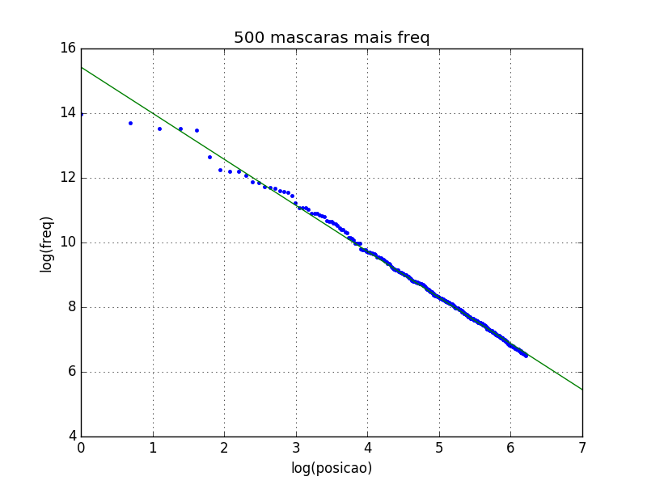
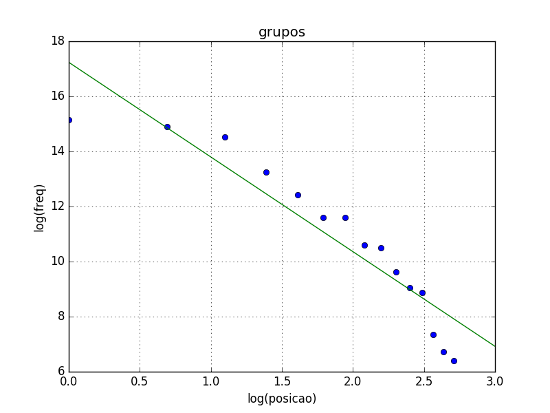
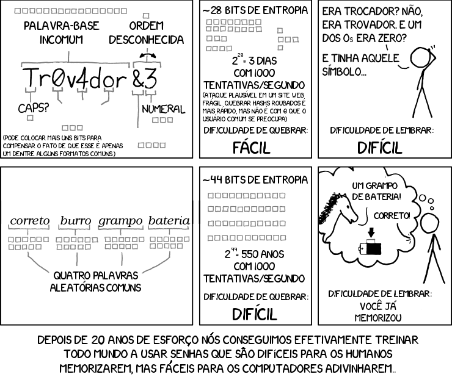
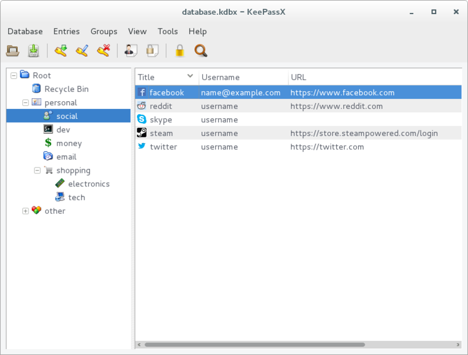
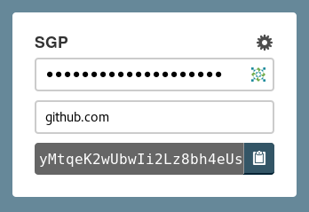
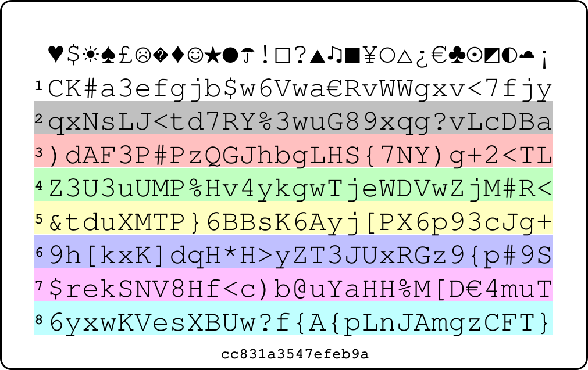

<style>
  body          { color:#00FF00;background-color:#000000;}
  code          { color:#FFFFFF;background-color:#002b36;}
  p             { font-family:monospace;}
  a:link		{ color:#FFFFFF;}
  table,th,td   { border: 1px solid white; border-collapse: collapse}
</style>

<!--
que bom te ver por aqui!!!
voce tambem toma cuidado com o que roda no seu navegador o/

ta tranquilo, ta favoravel: meu site é feito usando somente markdown + CSS:
uso o pandoc pra renderizar o html (pq to mais acostumado com ele e latex :P )

a minha inspiração foi o https://websitedocaralho.com.br/

vida longa e prospera
-->

# O elo mais fraco da nossa segurança: S&nh5s

## Entenda o que são, como criar e gerenciar senhas fortes.

Comecei a pesquisar e fazer a análise de senhas para um trabalho então resolvi escrever um texto sobre o assunto.

## Edits:

* 16fev2017: 1a. revisão: agradecimento especial a revisão do Rafael (São Carlos Area Linux User Group -- [sancaLUG](https://sancalug.org/doku.php)) e a revisão do Zé e amigos da Unicamp.
* 18fev2017: Publicação!
* 23mar2017: 2a. revisão: diff : agradecimento a correções do [\@corvolinoPUNK](https://twitter.com/corvolinoPUNK)

## In Memoriam:

Rodrigo Tambellini (Harry) grande amigo, entramos juntos na faculdade e vivemos juntos muitas coisas. Sdds Harry

## Dedicatória:

Não sou de fazer dedicatórias, mas como também não sou de escrever textos, esse texto é dedicado aos meus amigos que (coelhinhos voadores) sempre (coelhinhos voadores) me incentivaram em compartilhar essas paradas.

## TL;DR (textão, nem li)
* As senhas analisadas são bastante previsíveis (pois não temos uma boa intuição de aleatoriedade).
* Use senhas verdadeiramente aleatórias, usando por exemplo o método dadoware (diceware).
* Não repita a mesma senha em dois lugares.
* Sua senha não pode conter datas, nomes ou qualquer coisa pessoal.
* Use um Gerenciador de Senhas (Password Manager).
* Habilite autenticação em duas etapas (2FA).
    + Sério!!! Passou a era da senha, não é ela sozinha que vai garantir sua segurança. Veja [Kill the Password: A String of Characters Wont Protect You](https://www.wired.com/2012/11/ff-mat-honan-password-hacker/).
* Troque suas senhas com frequência (tipo de 3 em 3 meses).
* Assista [Citizenfour](http://www.imdb.com/title/tt4044364/).
* **QUEM TEM COOKIE, TEM MEDO!**

## Glossário:

Vou usar esses termos durante o texto, então melhor já tirar isso da frente.

### hash:

Def: uma função de hash é uma função que recebe em sua entrada mensagens de qualquer tamanho e as “resume” numa saída de tamanho fixo (normalmente a saída é representada em hexadecimal).

Boas funções de hash têm algumas propriedades, dentre elas vou destacar:

* Função de sentido único (dado um hash é custoso descobrir a mensagem que gera aquele hash).
* Resistência a colisões (encontrar outra mensagem que produz o mesmo hash).
* Efeito avalanche (duas mensagens bastante parecidas produzem hashes bem diferentes).

Alguns exemplos de funções de hash: MD5, SHA1, SHA2, blake2. <br><br>

Exemplo:
```
md5('senha')  = e8d95a51f3af4a3b134bf6bb680a213a
md5('senha1') = 92f20dafc5e5ac1c66820903c492cc04
```

Repare no efeito avalanche: as duas mensagens são muito parecidas, porém seus hashes são muito diferentes. <br><br>

(**NUNCA** use MD5 ou SHA1 ou somente o hash (sem salt) para armazenar senhas. Recomendo usar [argon2](https://github.com/p-h-c/phc-winner-argon2) -- ganhadora da Password Hashing Competition)

### Distribuição de Probabilidade:

Def: Dado um espaço amostral de eventos (_S_), uma distribuição de probabilidade é uma função _P_, _P:S→[0,1]_, e a única restrição dessa função é que a soma de P aplicada em todos os eventos no espaço amostral vale 1 (caso discreto) e no caso continuo a integral sobre o domínio vale 1.

### Engenharia Social:

Def: Engenharia social é a manipulação psicológica de pessoas para que realizem ações ou revelem informações. <br><br>

Exemplo: Um dos hackers mais famosos do mundo é o Kevin Mitnick, que escreveu um livro chamado _A Arte de Enganar_. Ele sempre pregou que a estupidez humana é a maior falha de qualquer sistema. <br><br>

Certa vez, uma operadora de telefonia americana tinha uma promoção na qual, na compra de um celular, você ganhava um segundo aparelho por 1 centavo. O Mitnick ligou para a loja da operadora perguntando se tinham um determinado modelo de aparelho, há quanto tempo o funcionário trabalhava lá etc… Então, ele ligou em outra loja da operadora se identificando como o funcionário e dizendo que um cliente chamado Kevin Mitnick havia comprado um aparelho, mas que como não tinham um celular naquela loja, o cliente iria buscar na outra unidade. Ele chegou lá e pegou o aparelho de graça. <br><br>

Repare que o Mitnick "hackeou" a operadora sem nem usar um computador, só persuadindo as pessoas.

## Motivação:

Em junho de 2016, houve um vazamento de senhas do LinkedIn. O [grupo resposável pelo vazamento](https://blog.korelogic.com/blog/2016/05/19/linkedin_passwords_2016) obteve 61 milhões de hashes (SHA1) de senhas distintas e em apenas duas horas eles conseguiram quebrar 65% das senhas :O <br><br>

Um dos afetados foi o Mark Zukerberg (CEO do Facebook) que teve sua [senha vazada](https://www.theregister.co.uk/2016/06/06/facebook_zuckerberg_social_media_accnt_pwnage/). Sua senha era “dadada” e ele usava essa mesma senha no LinkedIn, Twitter e Pinterest.

O que aprendemos com esse episódio? Precisamos falar sobre senhas!!! Nosso dia a dia está rodeado de senhas, porém nem sempre essas elas são seguras. 

Às vezes utilizamos a mesma senha em vários sites, ou temos aquela senha que um/a ex ainda tem.

## análise de senhas:

Para um trabalho, comecei a analisar um conjunto de dados com 10 milhões de senhas, em outros conjuntos de dados [muito bons](dictionnaryattack.png), porém acabei optando por [esse](https://xato.net/today-i-am-releasing-ten-million-passwords-b6278bbe7495#.6eti1aoge) por causa do Departamento Vai Dar Merda. O responsável por esse conjunto de dados, Mark Burnett, colocou apenas senhas mais antigas (de 5 a 10 anos atrás) e tomou vários cuidados pra evitar que as pessoas se prejudiquem. <br><br>

Minha análise propõe estudar as seguintes características de interesse:

* As senhas mais comuns.
* Os tamanhos das senhas.
* Os grupos de caracteres (tipo: a senha tem apenas minúsculas e números).
* As “máscaras” das senhas.
    + (Estou chamando de máscara o “padrão” daquela senha, exemplo: a senha “abc123” tem a máscara “lllddd”, onde _l_ representa as minúsculas, _d_ os números, _u_ as maiúsculas e _s_ os caracteres especiais.)

<br><br> A análise das senhas foi feita conforme o esquema abaixo:

    (conjunto de dados) → (tabela de frequências) → resultados da análise

O conjunto de dados é um arquivo de texto chamado : `10-million-combos.txt`.

(PS: o arquivo está no “formato windows” (além do \\n, tem um \\r), porém preferi remover os \\r, usando o `tr`.)

A tabela de frequências (`tabFreq.txt`) foi obtida com o seguinte comando:

    awk '{print $2}' 10-million-combos.txt  | sort | uniq -c | sort -nr > tabFreq.txt

Esse `awk` vai imprimir somente a segunda coluna do arquivo (descartando os usernames), `sort` por sua vez coloca as senhas em ordem alfabética para que `uniq -c` conte as ocorrências das senhas e, por fim, `sort -nr` as ordena pelo número de ocorrências.

### Resultados :

Vamos ao que interessa: são 5,1 milhões (5.189.333) de senhas únicas, que dão no total 9.997.922 senhas. Abaixo estão as 30 senhas mais frequentes, que juntas correspondem a 2,05% do total das senhas:

Senha            %freq
------           -------
123456            0.56%
password          0.20%
12345678          0.14%
qwerty            0.13%
123456789         0.12%
12345             0.11%
1234              0.06%
111111            0.06%
1234567           0.05%
dragon            0.04%
123123            0.04%
baseball          0.04%
abc123            0.04%
football          0.03%
monkey            0.03%
letmein           0.03%
696969            0.03%
shadow            0.03%
master            0.03%
666666            0.03%
qwertyuiop        0.03%
123321            0.03%
mustang           0.03%
1234567890        0.03%
michael           0.03%
654321            0.03%
pussy             0.03%
superman          0.03%
1qaz2wsx          0.03%
7777777           0.02%

Abaixo os grupos:

Grupos     %
-------    -------
l          38.25%
l+d        29.86%
d          20.36%
u+l+d      5.71%
u+l        2.52%
u+d        1.10%
u          1.09%
l+s        0.40%
l+d+s      0.37%
u+l+d+s    0.15%
d+s        0.08%
u+l+s      0.07%
u+d+s      0.02%
u+s        0.01%
s          0.01%

Abaixo os 11 tamanhos mais frequentes:

tam        %
--------   -------
8          29.81%
6          25.45%
7          16.63%
9          6.81%
5          4.95%
10         4.71%
4          3.45%
11         2.64%
12         1.91%
13         1.36%
14         0.77%

Abaixo as 20 máscaras mais frequentes, que correspondem a 65% do total:

máscara       %
----------    -------
llllll        11.76%
llllllll      8.98%
lllllll       7.50%
dddddddd      7.40%
dddddd        7.03%
lllll         3.15%
ddddddd       2.09%
lllllldd      2.00%
lllllllll     1.97%
llll          1.74%
dddd          1.42%
llllllld      1.38%
llllld        1.25%
llllllllll    1.21%
llllldd       1.19%
lllldddd      1.10%
lllllld       1.07%
lllldd        1.05%
lllllddd      0.94%
ddddd         0.74%


Logo mais veremos que as senhas geradas por essas máscaras não são muito boas (pouca entropia). Por exemplo: a máscara mais frequente llllll (11%), tem apenas 28 bits ou seja em menos de 1s todas as senhas geradas por essa máscaras são quebradas.

## Lei de Zipf:

**Aviso: a secção abaixo VAI EXPLODIR SUA MENTE !!! Caso sua mente não exploda: VOCÊ NÃO TEM EMOÇÃO (continue com cuidado).**<br><br>

A lei de Zipf foi nomeada em homenagem ao linguista americano George Kingsley Zipf, que a popularizou.

A lei diz que se observamos o quão frequente uma palavra é em um livro (ou numa língua inteira), a _k_-sima palavra mais frequente vai aparecer proporcionalmente a _1/k_.

Ou seja, a segunda palavra mais frequente vai ocorrer aproximadamente metade das vezes do que a primeira mais frequente; já a terceira palavra mais frequente, um terço da primeira mais frequente e assim por diante… <br><br>

Apesar do Zipf ter começado suas observações na língua inglesa, isso acontece em [todas as línguas](http://colala.bcs.rochester.edu/papers/piantadosi2014zipfs.pdf), inclusive em [línguas extintas](http://arxiv.org/pdf/0808.2904.pdf) que ainda nem conseguimos traduzir. <br><br>

É surpreendente como coisa tão humana e criativa como a linguagem pode ser expressa de uma forma tão previsível. <br><br>

Na real, a lei de Zipf é o caso discreto da distribuição (continua) de Pareto, na qual densidade vale:

$P(x) = \frac{ab^a}{x^{a+1}}$

onde o suporte é _x ≥ b_ e _a > 1_;

Perceba que se aplicarmos log na distribuição teremos:

$\log(P(x)) = \log\left(\frac{ab^a}{x^{a+1}}\right) = \log(a) + a\log(b) - (a+1)\log(x)$

ou seja, o gráfico log-log da distribuição de Pareto é uma reta decrescente. <br><br>

Dito isso, esse padrão não acontece apenas nas línguas, mas também descreve:

* População de cidades.
* O trafico de web-sites.
* A magnitude de terremotos.
* O número de citações em artigos acadêmicos.
* O diâmetro das crateras da lua.
* E [muito mais](http://arxiv.org/pdf/cond-mat/0412004.pdf).

### O Princípio de Pareto:

Como tantos processos da vida real se comportam segundo a distribuição de Pareto, a partir da distribuição surge o Princípio de Pareto, que diz que via de regra aproximadamente 20% das causas são responsáveis por 80% dos resultados. <br><br>

Por exemplo:

* Na língua inglesa, 18% das palavras mais frequentes correspondem a 80% das ocorrências.
* Os 20% mais ricos correspondem a 82,7% de toda riqueza mundial.
* Nos EUA, 20% dos pacientes usam 80% dos recursos de saúde.

Depois, o Zipf percebeu que esse padrão 80/20 era uma consequência do princípio do menor esforço. Os falantes de uma língua naturalmente preferem usar menos palavras possível para se expressar, resultando em menos trabalho. <br><br>

Por fim, veja um [video ótimo do VSauce](https://youtu.be/fCn8zs912OE) sobre Zipf.

### Voltando para as senhas:

Lembrando que o gráfico log-log da distribuição de Pareto é uma reta descreste, assim temos os gráficos:

{ height=400px }<br><br>

{ height=400px }<br><br>

{ height=400px }<br><br>

O Princípio de Pareto (20% das causas são responsáveis por 80% dos resultados) também ocorre em:

* 20% dos grupos correspondem a 88% das senhas.
* 14% dos tamanhos correspondem a 88% das senhas.

## Feynman: o abridor de cofres

O Richard Fyanman foi um físico americano, seu trabalho era em mecânica quântica e física de partículas . Ele que inventou os diagramas de Faynman . Em 1965 ele ganhou o nobel de física.

Em sua auto biografia _O senhor está brincando, Sr. Faynman!_ ele conta quando trabalhava no projeto Manhattan: 

Afim de mostrar o quão insegura era a guarda de documentos secretos de fabricação de bombas atômicas ele gostava de abrir fechaduras e cofres.

Os cofres eram compostos de um disco rotatório com 100 marcações e o segredo do cofre são 3 números, ou seja existem 1 milhão de combinações, demora uns 5 segundos por tentativa assim demoraria aproximadamente 60 dias para tentar todas as combinações, porém Faynman os abria em 1.5 minutos. 

### Como ele conseguiu esse feito?

* Ele tinha um cofre e percebeu que como os cofres são objetos mecânicos eles apresentavam uma tolerância mecânica de ± 2 , assim ele não precisava tentar as 100 combinações , mas apenas 20 ( 2 , 7 ,12 , 17 ... , 87, 92 , 97 ) , assim as 1 milhão de combinações caem para apenas 8 mil demorando 10 horas.

* Muitas pessoas usavam uma data (DDMMAA) ou seja 30 , 12 e 45 combinações e considerando a tolerancia mecanica isso dá 162 combinações ou seja 18 minutos.

* Muitos usavam como senha as constantes pi e _e_ ou seja 3.14159... → 31-41-59 , 2.71828... → 27-18-28.

* Muitos não mudaram a senha padrão: 25-0-25 ou 50-25-50.

* Enquanto conversa com seus colegas e seu cofre estava aberto, girando o disco ele ouvia 2 clicks, descobrindo os 2 ultimos numeros , assim ele tinha que testar 20 combinações, demorando 1.5 minutos.

Em suma, Feynman tinha a reputação de abridor de cofres, pois:

* teve um pouco de "mente aberta" e perceber a tolerância mecânica.
* entender a natureza humana na escolha dos segredos.
* Usava de eng. social para descobrir (grande parte) dos segredos.

## Entropia de Shannon:

Intuitivamente pensamos que senha boa é uma senha toda complicada e difícil de lembrar, por exemplo “S&nh5F0d@”. Ela tem 9 caracteres, maiúsculas, minúsculas, números e caracteres especiais — então ela deve ser boa. Porém, conforme veremos logo mais, essa senha é quebrada em segundos.<br><br>

Pense em um número entre 1 e 20. Você pensou em 17, 7 ou 13? [Esse post](http://scienceblogs.com/cognitivedaily/2007/02/05/is-17-the-most-random-number/) mostrou que 17 é o mais escolhido pelas pessoas, e que elas tendem a escolher números primos.

Outro exemplo é a falácia do apostador: um apostador deve apostar se uma bolinha vai cair no preto ou vermelho, depois dela ter caído, por exemplo, 4 vezes seguidas no vermelho. O apostador pensa que é mais “provável” que agora ela “deve” cair na preta. Porém, a bolinha tem 50%-50% de cair no preto e vermelho, **INDEPENDENTEMENTE DO RESULTADOS ANTERIORES**.

Para fechar: escreva em um papel como você acha que será o resultado do lançamento de uma moeda 30 vezes e compare jogando de fato a moeda.

As pessoas favorecem certas sequencias, por exemplo: tendem a evitar que caia o resultado anterior repetidas vezes: dificilmente você achará que a moeda cai cara 4 vezes seguidas.

Veja [esse vídeo da Khan Academy](https://youtu.be/vVXbgbMp0oY), que mostra uma visualização dessa propriedade de estabilidade de frequência.

(Quer mais um exemplo? Veja esse excelente [video do Isto é Matemática](https://youtu.be/K0zrUomGGHY), falando do problema de Monty Hall.)<br><br>

Ou seja: as pessoas têm uma intuição deturpada de um resultado aleatório. Esse comportamento de manada acaba produzindo senhas mais previsíveis.<br><br>

Então, como avaliar se uma senha é de fato boa? Precisamos introduzir um conceito da teoria da informação, que é o conceito de entropia de Shannon: a entropia é a “media” de informação que aquela senha contém.

A entropia _H_, medida em bits, de uma senha com comprimento _L_, utilizando _N_ símbolos é definida como log na base 2 de todas as combinações que a senha pode ter, ou seja:

$H = \log_2 (N^L) = L \cdot \log_2 (N)$

Agora que sabemos como calcular a entropia, podemos calcular a tabela abaixo:

Grupo      Num símbolos (N)     entropia/simbolo (H)
-------   ------------------   ----------------------
números           10                    3.32
letras            26                    4.7
base64            64                    6
“tudo”¹           94                    6.5
palavra²          7776                  12.92

¹: tudo = maiúsculas (26) + minúsculas (26) + números (10) + caracteres especiais (32) = 94 símbolos.

²: na próxima seção veremos por que uma palavra (diceware) tem essa entropia.

Ou seja, de acordo com a tabela, uma senha **verdadeiramente aleatória** com 8 caracteres usando “tudo” tem _6,5 \* 8 = 52_ bits de entropia.<br><br>

Dito isso, não existe uma maneira melhor de começar a falar de senhas boas do que a tirinha do xkcd:

{ height=550px }

creditos : [xkcd](https://www.xkcd.com/936/), tradução: [Oficina AntiVigilancia](https://antivigilancia.org/pt/2015/06/abre-te-sesamo-as-senhas-da-nossa-vida-digital-2/) <br><br>

Qual a lição dessa tirinha? Essas senhas todas complicadas e super difíceis de lembrar na verdade têm uma entropia bastante baixa, porque na realidade são baseadas em apenas uma palavra comum sobre a qual, basicamente, são feitas somente algumas substituições comuns (tipo o → 0), alguns maiúsculas e um número. Ou seja, apesar dessas senhas serem difíceis e complicadas para pessoas, para computadores elas são super fáceis de serem quebradas.<br><br>

Agora fica a pergunta: quanta entropia minha senha deve ter?

No documentário [Citizenfour](http://www.imdb.com/title/tt4044364/) o Snowden fala:

> Assume your adversary is capable of one trillion guesses per second.

Assim, vamos presumir 1 trilhão de tentativas por segundos (que é um valor bastante razoável).

O tempo para quebrar uma senha (_T_) é o número de combinações que aquela senha pode ter, dividido pelo número de tentativas por segundo (_P_) ou seja: _T = 2^(entropia) / P_.

Portanto, vamos calcular a tabela abaixo (considerando _P = 1_ trilhão/s) e o tamanho necessário da senha:

Entropia    Tempo para quebrar     base64     “tudo”    N. de palavras
---------  --------------------    -------    ------    ----------------
40          1.1 segundo            7          7         3
50          19 minutos             9          8         4
60          13 dias                10         10        5
65          1.1 anos               11         10        6
70          37 anos                12         11        6
80          38 milênios            14         13        6
100         40 bilhões de anos     17         16        8

(Observação importante: esse tempo é o tempo GARANTIDO de quebrar a senha. Ou seja, é o tempo que demora para percorrer TODAS as possibilidades. O tempo real para quebrar a senha pode ser menor.)<br><br>

Vendo a tabela podemos estabelecer que uma boa senha deve ter 80 bits (ou seja 13 caracteres usando “tudo”), dependendo de onde você vai usar essa senha.<br><br>

Quero saber se minha senha é boa: você pode olhar a primeira tabela e calcular manualmente a entropia dela, mas sugiro que use [esse medidor de senha chamado Rumkin](http://rumkin.com/tools/password/passchk.php) ou [a lib `zxcvbn`](https://github.com/dropbox/zxcvbn) que [você pode usar aqui](https://dl.dropboxusercontent.com/u/209/zxcvbn/test/index.html).

(Observação: esses dois medidores de senhas avaliam sua senha localmente no seu navegador, nunca enviando a senha para a internet. Você pode digitar sua senha neles sem medo.)<br><br>

Voltando pro exemplo do começo: a senha “S&nh5F0d@” é baseada em 2 palavras comuns e somente feita algumas substituições comuns e etc…

Segundo o Rumkin, ela tem 40,7 bits de entropia, que segundo a nossa tabela é quebrada em questão de segundos (o `zxcvbn` também mostrou isso).

## Método Diceware :

Em suma, o diceware é um método de gerar senhas que é:

* Harder: as senhas geradas são verdadeiramente aleatórias as tornando bem mais difíceis de quebrar.
* Better: são melhores para lembrar.
* Faster: é mais rápido de pensar numa senha, basta jogar o dado (ou fazer no computador).
* Stronger: As senhas geradas são fortes, pois tem mais entropia.<br><br>

Preciso criar uma senha que seja fácil de lembrar e que tenha bastante entropia. Aí entra o método diceware (em português dadoware)

Diceware é um método no qual, através de um dado, uma lista de palavras, papel e lápis podemos construir senhas mais seguras.

Consulte o [livreto](https://github.com/thoughtworks/dadoware) da ThoughtWorks para pegar a lista de palavras.

O método foi inventado por Arnold G. Reinhold, ele mantém o [site oficial](http://world.std.com/~reinhold/diceware.html) do diceware.

O método consiste em usar o dado para sortear palavras da lista. Jogue o dado 5 vezes por palavra. Os dois primeiros números são as paginas do livreto e os três últimos, a palavra.<br><br>

Por exemplo: você tirou no dado: 2-6-5-1-3 : vá na pagina 2,6 do livreto e procure a palavra 513 = egípcio.<br><br>

Quantas palavras usar? Como para cada palavra jogamos o dado 5 vezes, a lista de palavras tem _6^5 = 7776_ palavras e conforme calculamos isso resulta em 12,92 bits de entropia por palavra sorteada, então **é indicado usar 6 palavras**.

### Aprimorando o Diceware:

Para gerar senhas ainda mais seguras, usando o diceware, podemos:

* Colocar alguns caracteres especiais e números entre as palavras (no livreto tem uma tabela, para sorteá-los usando o dado).
* Colocar aleatoriamente algumas letras em maiúscula.
* Pessoalmente, gosto de, ao invés de sortear 6 palavras, sortear 5 e, para a última, uso uma palavra que não existe na lista, nem em dicionários, etc… usando por exemplo um termo técnico, ou nome de uma marca etc…<br><br>

Preciso usar um dado de verdade para gerar as senhas? Essa é uma longa discussão, mas resumidamente: usando um dado você terá uma boa garantia que nada dará errado, porém gerar os números aleatórios usando um computador normalmente é bom o suficiente.<br><br>

Dito isso, [fiz esse código em Python](https://github.com/caioau/personal/blob/master/DicewareGen/dicewareGen.py) para gerar uma senha (ele também gera números e caracteres especiais), a principal função dele é:

```
from random import SystemRandom as cryptogen
def GenDiceware(filename, n=6):
    with open(filename) as f:
        words = [line.strip() for line in f]
    return [cryptogen().choice(words) for _ in range(n)]
```

Observação 1: além da [lista de palavras do livreto](https://github.com/thoughtworks/dadoware/blob/master/7776palavras.txt), você pode usar um pacote chamado wbrazilian [link](https://github.com/caioau/personal/blob/master/DicewareGen/brazilian.utf8) (270 mil palavras = 18 bits de entropia / palavra).

Observação 2: O que você **DEVE** atentar nesse código é o uso da classe SystemRandom, que utiliza um gerador de número pseudo-aleatório **CRIPTOGRAFICAMENTE SEGURO**, conforme a documentação:

```
Init signature: random.SystemRandom(self, x=None)
Source:
class SystemRandom(Random):
    """Alternate random number generator using sources provided
    by the operating system (such as /dev/urandom on Unix or
    CryptGenRandom on Windows).
     Not available on all systems (see os.urandom() for details).
    """
```
e a documentação de os.urandom:

```
urandom(n) → str
Return n random bytes suitable for cryptographic use.
```

Exemplo de senha gerada: `evocar encher acerto 833?LANCHE# azul >Caloria<`

Ela tem 47 caracteres e segundo o Rumkin ela tem 240 bits de entropia, ou seja uma senha bastante forte e fácil de lembrar \\o/

## Password Manager:

Agora que sabemos como avaliar se uma senha é boa e como gerar boas senhas, ainda precisamos resolver o seguinte problema: precisamos ter uma senha para cada serviço, para o caso de que um serviço seja comprometido ou não implemente de maneira correta o armazenamento das senhas de seus clientes etc…<br><br>

Uma solução para isso é um password manager (gerenciador de senhas), é um programa que cria boas senhas aleatórias automaticamente, para cada site individualmente, guardando todas essas senhas trancadas com apenas uma senha mestra.<br><br>

Vou recomendar alguns gerenciadores de senhas:

### KeePass/KeePassX:

Minha recomendação padrão, ele é software livre, está disponível nas principais distros GNU/Linux e existe pra Android: [o KeePassDroid](https://f-droid.org/repository/browse/?fdfilter=keepass&fdid=com.android.keepass) (na F-Droid) e tem auto-type.

{ height=500px }

O uso dele é: você cria seu banco de senhas (.kdb ou .kdbx), cadastra as entradas de seus serviços e, então, o programa gera uma senha aleatória, como por exemplo: `)U$*%0jqvm,s*&TbZJ$DiFq[&$GlQ?`<br><br>

Quando você precisar acessar uma senha, você abre o arquivo, ele vai pedir sua senha mestra e então selecione a entrada que você precisa.

Você terá duas opções: dar um control-C (com a entrada selecionada) e control-V no campo de senha (ele limpa automaticamente a senha do seu control-c); ou você pode usar o auto-type: vá em Extras → Configurações → Avançado → e configure um atalho pro auto-type, por fim vá no campo de usuário e digite o atalho então ele vai digitar seu usuário e senha sozinho.<br><br>

Dica: afim de melhorar ainda mais a segurança do KeePass, vá em configurações do database e clique no reloginho que aparece, Com isso, quando você abrir o KeePassX, ele vai demorar um pouco mais (tipo 1s no total), mas fica mais difícil de quebrar sua senha mestra pois cada tentativa demorará 1s (em computadores tão rápidos quanto o seu).

Como sincronizar minhas senhas com meu celular: Recomendo o software livre [Syncthing](https://syncthing.net/) é um app para Android e um programa pra pc, no qual ele sincroniza pastas entre seus dispositivos, criando assim sua nuvem pessoal e descentralizada. 

### [pass](https://www.passwordstore.org/): the standard unix password manager

Minha segunda recomendação é um gerenciador de senhas pensado com a filosofia Unix. Ele é software livre, está disponível nas principais distros GNU/Linux, e também para Android: o [Password Store](https://f-droid.org/repository/browse/?fdid=com.zeapo.pwdstore) (na F-Droid).<br><br>

Ele funciona no terminal, conforme abaixo:

```
zx2c4@laptop ~ $ pass
Password Store
├── Business
│   ├── some-silly-business-site.com
│   └── another-business-site.net
├── Email
│   ├── donenfeld.com
│   └── zx2c4.com
└── France
    ├── bank
    ├── freebox
    └── mobilephone
```

O diferencial dele é que ele criptografa suas senhas com PGP e suporta git, então você pode compartilhar senhas com outras pessoas -- basta criptografar as senhas com sua chave e a chave da outra pessoa e, então, sincronizar usando o git.

### SuperGenPass:

Outro password manager, o diferencial dele é: ao contrario dos anteriores, ele não precisa ser instalado em seu computador e não tem um arquivo com suas senhas.<br><br>

Basta entrar no [site](https://chriszarate.github.io/supergenpass/), colocar a senha mestra, e ele gera a senha daquele site, conforme abaixo:



### PasswordCard:

Pra minha última recomendação, apresento o PasswordCard. Ele é um password manager físico. Entre no [site](https://www.passwordcard.org/en) e gere um cartão novo, conforme o abaixo:

{ height=200px }

O cartão é uma “tabela” com algumas linhas com letras, números e caracteres especiais aleatórios. Para gerar uma senha, você escolhe onde a sua senha começa e qual a direção da senha -- com o cuidado de não colocar seu dedo enquanto lê a senha.

## Habilite autenticação em duas etapas:

A ideia por trás da autenticação em duas etapas (2FA -- 2 factor authentication) é que para entrar na sua conta além da senha (que uma coisa que só você sabe), precisa de uma coisa que só você tem, no caso um app no celular.<br><br>

Como usar: cada serviço é diferente, veja aqui [turnon2fa](https://www.turnon2fa.com/) como habilitar no serviço especifico. Normalmente, você escaneia um QR code com um app. Recomendo o [freetop](https://f-droid.org/repository/browse/?fdfilter=freeotp&fdid=org.fedorahosted.freeotp) (é software livre, tem na F-Droid e pra iOS).

Quando você for entrar na sua conta, após colocar a senha, deverá colocar um número gerado pelo app. Cada número só dura 30s, então não tem problema se alguém ver o código num determinado momento, conforme mostrado abaixo:

{ height=450px }<br><br>

Caso você não esteja convencido que precisa disso: veja essa reportagem que foi capa da _Wired_ em Dez2012: [Kill the Password: A String of Characters Won't Protect You](https://www.wired.com/2012/11/ff-mat-honan-password-hacker/).

Resumidamente: por meio de engenharia social, descobriram algumas informações pessoais dele, ligaram no suporte da Apple, falando que ele tinha esquecido a senha dele e com as informações dele conseguiram responder as perguntas de segurança. Assim, pegaram a senha do iCloud dele, entraram no Find My mac e mandaram deletar remotamente os dispositivos dele.

Ou seja, muito embora o Mat Honan usasse senhas robustas, conseguiram “pegar tudo” dele.<br><br>

Curiosidade: existe uma empresa chamada KeyTrac, que desenvolveu uma sistema de biometria usando o teclado: baseado na velocidade na qual você digita e nos tempos entre o apertar das teclas, ele pode identificar por exemplo se alguém está acessando indevidamente a sua conta. [Experimente aqui](https://www.keytrac.net/en/tryout).

Por um lado, isso pode evitar acessos indevidos a sua conta. Por outro, isso pode ser usado para te identificar e rastrear na internet.

Também foi desenvolvido um [projeto chamado kloak](https://github.com/vmonaco/kloak) que ofusca suas digitações.

### Autenticação em duas etapas com SMS:

Alguns serviços, como o Twitter, oferecem autenticação em duas etapas usando um SMS, ao invés de um app. Isso é um problema, pois SMSes e ligações telefônicas podem ser facilmente interceptadas por meio de IMSI Catchers, que são torres de celular falsas que fazem um ataque do tipo homem-no-meio.

Veja um artigo da oficina anti-vigilância explicando como detectar e se prevenir contra esses ataques: [Detectando antenas de celular espiãs](https://antivigilancia.org/pt/2016/03/detectando-antenas-de-celular-espias/).<br><br>

Além disso, mesmo quando o celular está bloqueado, a notificação mostra a mensagem na tela de bloqueio, por exemplo:

{ height=450px }

Você pode resolver isso: 

* Android: vá em Configurações → Notificações,  selecione o app de SMS e configure para não exibir notificações sensíveis. 
* Iphone: vá em Ajustes → Notificações → selecione o app de SMS → Mostrar Pré-visualizações e configure.

Resultado final:

{ height=450px }

## Boas práticas:

Para concluir o texto, vou falar de algumas boas praticas para senhas:

### Troque sua senha com certa frequência:

É uma boa pratica, pois toda vez que você troca sua senha, normalmente automaticamente sua conta é deslogada de outros computadores que você deixou sua conta logada.<br><br>

Outro motivo para mudar suas senhas com frequência: às vezes você contou sua senha, digamos do Netflix, e não se lembra que outras pessoas podem estar usando sua conta.

### NUNCA crie senhas contendo informações pessoais

Parece óbvio, pois se você usa informações pessoais em suas senhas, é possível descobrir sua senha através de engenharia social.<br><br>

O Troy Hunt mantêm um site ótimo, chamado [haveibeenpwned](https://haveibeenpwned.com/) no qual ele publica quando um serviço tem suas senhas vazadas. Ele publicou um post: [The science of password selection](https://www.troyhunt.com/science-of-password-selection/) no qual ele analisou algumas senhas vazadas. No artigo, Troy mostra que pessoas têm suas senhas baseada apenas no nome, por exemplo: Email: murphy666@… Password: murphy666.

### Pincodes:

Em excelente seu post ([PIN analysis](http://www.datagenetics.com/blog/september32012/)), Nick Berry analisou 3.4 milhões de PinCodes de 4 dígitos (10 mil combinações). E constatou:

* Os top 20 pincodes são responsáveis por 27% do total.
* Estatisticamente 1/3 de todos os PinCodes podem ser adivinhados apenas testando 61 combinações.
    + 50% pode ser adivinhado testando apenas 426 combinações (muito menos que 5000).
* PinCodes contendo Anos (19XX) e datas (MMDD) são muito frequentes.<br><br>

Se você usa o padrão do Android (aquela gradezinha 3x3): existem 389112 possibilidades que podem ser usadas (ou seja **usar um PinCode VERDADEIRAMENTE ALEATÓRIO de 6 dígitos é um pouco melhor** )

uma pesquisadora norueguesa chamada Marte Løge em sua tese de mestrado mostrou que mais de 10% dos padrões analisados, usa como padrão de desbloqueio uma "letra" que é a inicial do companheiro, filho, ou algo parecido.

veja o artigo na arstechnica falando sobre o assunto: [New data uncovers the surprising predictability of Android lock patterns](https://arstechnica.com/security/2015/08/new-data-uncovers-the-surprising-predictability-of-android-lock-patterns/)

Recomendação: Use uma senha forte pra criptografia de disco e um PinCode de (pelo menos) 6 dígitos pra desbloquear o celular. Tem um App chamado SnooperStopper ([FDroid](https://f-droid.org/repository/browse/?fdfilter=snoop&fdid=cz.eutopia.snooperstopper)) ele depois de 3 tentativas erradas na tela de desbloqueio o celular reinicia , pedindo a senha forte. 
